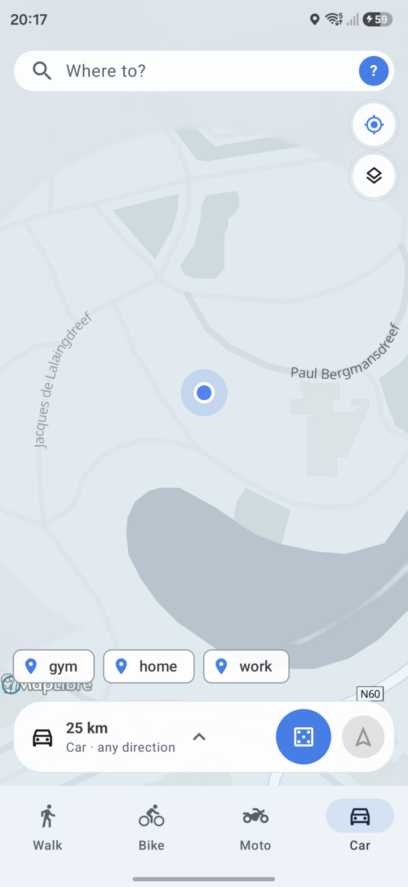
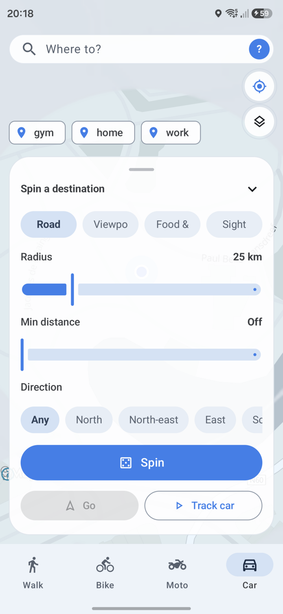
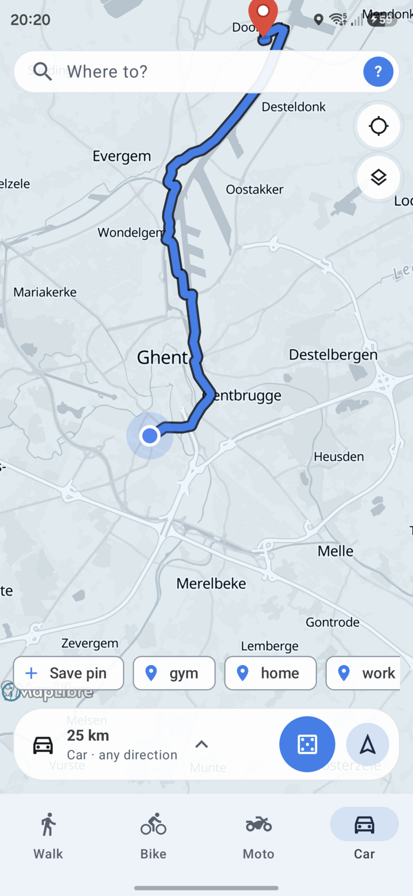
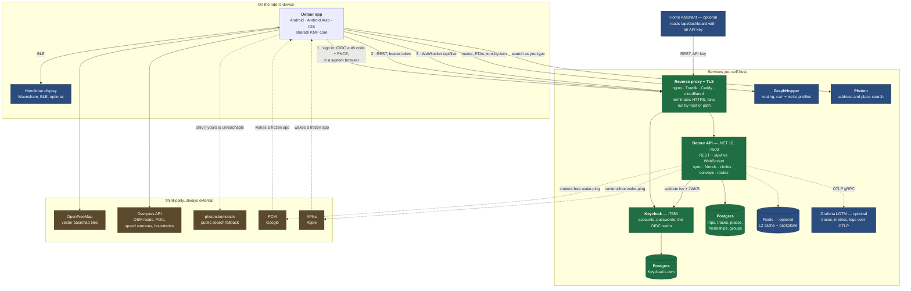
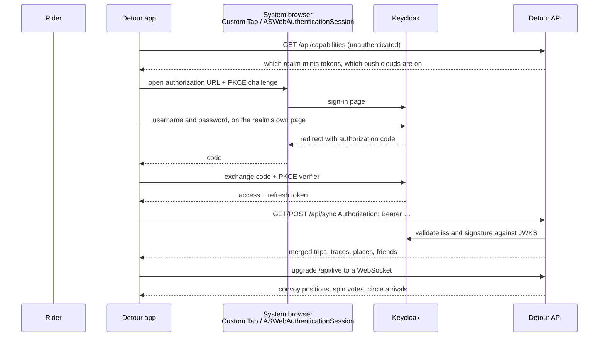

# Detour

Don't know where to drive? Set a radius, spin, get a random point on a real road, and go.

<table>
  <tr>
    <td align="center"><br><sub>The map</sub></td>
    <td align="center"><br><sub>Set up a spin</sub></td>
    <td align="center"><br><sub>A destination, routed</sub></td>
  </tr>
</table>

<sub>Screenshots were taken on a phone running a throwaway profile: synthetic
trips, invented saved places and a mocked GPS position around Ghent. Nothing in
them is a real location.</sub>

## Start here

| You are | Read |
| --- | --- |
| Riding with it | **[docs/USER_GUIDE.md](docs/USER_GUIDE.md)** — install, every screen, every setting |
| Building or changing it | **[docs/DEVELOPERS.md](docs/DEVELOPERS.md)** — prerequisites, layout, build, run the stack |
| Landing a change | **[CONTRIBUTING.md](CONTRIBUTING.md)** — branches, PRs, versioning, review, style |
| Running the server | **[Architecture](#architecture)** below, then [backend/INSTALL.md](backend/INSTALL.md) |
| Looking for something else | [docs/README.md](docs/README.md) — the full index |

The app itself works with **no account and no server**: spin, route hand-off,
trip recording, fog of war and badges are all local. A server buys sign-in, sync
across devices, friends, convoys and circles. In-app turn-by-turn buys a router.
Nothing published here has a server address baked in — you point the app at your
own under Settings.

## Architecture

Detour is a Kotlin Multiplatform core wrapped in two apps, talking to **up to
eight services you run yourself** and a handful of third-party ones. Only the
first three of yours are needed for an account to work at all.



### Every service, and what it is for

Green in the diagram is required for an account; blue is optional; brown is
somebody else's.

| Service | What it does | Required? | Without it | Runs from |
| --- | --- | --- | --- | --- |
| **Detour API** | The one service this repo *is*: trip and trace sync, saved places, friendships, convoys, circles, shared routes, the live WebSocket relay, and the read-only dashboard endpoints. .NET 10, listens on 7500, applies its own migrations at startup. | Yes, for an account | No sign-in, no sync, no friends, circles or convoys. The app is fully usable locally. | `docker/prod/docker-compose.yml`, or `ghcr.io/detour-app/detour-api` |
| **Postgres** (app) | Everything the API stores. Needs the real thing, not SQLite: `citext` handles, `jsonb` columns, real unique indexes. | Yes | The API will not start. | same compose file |
| **Keycloak** | Owns accounts and passwords. Detour has no registration form, no password form and no invite codes — sign-in happens on the realm's own page in a browser, and the API only ever sees the token it issued. | Yes | Nobody can sign in; there is no local fallback. | same compose file |
| **Postgres** (Keycloak) | Keycloak's own store, deliberately a second instance: separate product, separate upgrade cadence, and restoring one must never involve the other. | Yes | Losing it loses every login. | same compose file |
| **Reverse proxy with TLS** | Terminates HTTPS and fronts the API and Keycloak. The realm issues tokens against **one fixed issuer URL**, and that URL should be `https`. The prod compose binds everything to `127.0.0.1` on the assumption something sits in front. | In practice, yes | Tokens are issued against a plain-HTTP issuer, and mobile clients are unhappy about it. | Your choice. Overlays ship for [nginx](docker/prod/docker-compose.proxy.yml) and [Cloudflare Tunnel](docker/prod/docker-compose.cloudflare.yml); Traefik and Caddy work equally well |
| **GraphHopper** | Turn-by-turn routing, and the routed (rather than straight-line) distance and ETA on spin candidates. Must expose profiles named exactly `car` and `moto`. | No | "Navigate in app" is *absent*, not degraded, and spin candidates fall back to crow-flies distance. | You run it — [upstream](https://github.com/graphhopper/graphhopper). A dev instance is in `docker/dev` |
| **Photon** | Address and place search. | No | Search silently uses the public `photon.komoot.io` instead — unless you turn the fallback off. | You run it — [upstream](https://github.com/komoot/photon) |
| **Redis** | L2 cache behind FusionCache, plus its backplane. Empty config is a *correct* single-instance deployment. | No | A cache miss is a slower request, not a broken one. Wire it when you run more than one API container. | `--profile cache` in the prod compose |
| **Grafana LGTM** | Grafana, Loki, Tempo, Prometheus and an OTel collector in one container. The API exports over OTLP. | No | No traces, metrics or logs dashboard. | `docker/dev` only — production picks its own |
| **Home Assistant** | Optional consumer, not part of the stack: lifetime totals, badges and recent rides as HA entities, read from `/api/dashboard/*` with a dashboard API key that can only ever read its own owner's data. | No | — | [server/homeassistant/](server/homeassistant/README.md) |

Third-party, contacted by the **app** rather than by your server:

| Service | For | Notes |
| --- | --- | --- |
| **OpenFreeMap** | Vector basemap tiles | Sees your current map viewport |
| **Overpass API** | The OSM data behind spins, POIs, speed cameras and coverage boundaries | Sees the spin centre and radius you choose. Two public endpoints are used in rotation |
| **photon.komoot.io** | Search, when you have no Photon of your own or yours is down | Sees your query and an approximate location. Turn the fallback off to keep search on your own hardware |
| **FCM / APNs** | The content-free circle wake-ping | Your server talks to these, not the app. Both optional; without them circles still deliver over the socket and the catch-up sweep. See [docs/PUSH.md](docs/PUSH.md) |

### How the pieces connect

**Everything the app sends goes over HTTPS**, and the app addresses each service
directly — the API, the router and the geocoder are three independent addresses
in Settings, with one `url` covering them all only when a single host path-routes
to all three. The sign-in realm is a fourth address and deliberately never falls
back to the others.

Sign-in is standard OIDC authorization-code with PKCE, run in a **system
browser** rather than in the app, so Detour never sees a password:



Two consequences worth knowing before you deploy:

- **The issuer URL is load-bearing.** The API requires an exact `iss` claim, not
  a prefix, and Keycloak builds it from `KC_HOSTNAME` plus `/realms/<realm>`.
  Changing it invalidates every issued token and every stored redirect URI.
- **Keycloak must not sit behind an authenticating gateway** such as Cloudflare
  Access. The token exchange has no way to answer the challenge, and sign-in
  fails in a way that looks like a client bug. See
  [docker/prod/CLOUDFLARE.md](docker/prod/CLOUDFLARE.md).

The live relay is a single WebSocket at `/api/live`, shared by convoys and
circles. Convoy positions are relayed between open sockets and **never written
down**; a circle keeps exactly one row per member — the latest fix, overwritten
in place, no history and no trail. Push-to-talk frames are accepted off the wire
and dropped: voice is deferred, not broken, and will come back as Opus over
binary frames rather than the raw PCM base64'd into JSON that cost roughly
40 KB/s per talker per listener. The wire format of every frame is
[docs/CIRCLES_AND_CONVOYS.md](docs/CIRCLES_AND_CONVOYS.md).

Behind a proxy, **name the proxy** — set `ForwardedHeaders__KnownNetworks` or
`__KnownProxies`. Both are empty by default, which makes the API ignore
`X-Forwarded-*` entirely; that is the safe default and the wrong one once
anything sits in front, because every caller then shares a single rate-limit
bucket keyed on the proxy's address. [backend/INSTALL.md](backend/INSTALL.md#behind-a-reverse-proxy)
has the detail, including why clearing the lists to "trust everything" is worse
than leaving them empty.

## Running a server

Be honest about the shape first: this is **five processes minimum** — the API,
its Postgres, Keycloak, Keycloak's Postgres, and a reverse proxy — plus two more
(GraphHopper and Photon) that this repo does not package or start for you.
Accounts, passwords and resets stop being this project's job, which is the point,
but it is not a smaller thing to run than the single-file Python server it
replaced. There is no importer for an old `detour.db`, and passwords cannot be
carried across at all.

**A development machine** — working passwords on purpose, Keycloak in dev mode,
the realm imported, and GraphHopper included:

```bash
docker compose -f docker/dev/docker-compose.yml up -d
```

**Anywhere real** — no default passwords anywhere; compose refuses to start until
every secret is set, and no realm is imported, because the dev realm ships a user
whose password is in this repository:

```bash
cp docker/prod/.env.example docker/prod/.env
docker compose -f docker/prod/docker-compose.yml up -d
```

| Document | Covers |
| --- | --- |
| [backend/INSTALL.md](backend/INSTALL.md) | Every configuration key, the container, the reverse-proxy trap, what is still missing |
| [docker/prod/README.md](docker/prod/README.md) | The production stack, and the realm you have to create yourself |
| [docker/prod/CLOUDFLARE.md](docker/prod/CLOUDFLARE.md) | Exposing it through a tunnel — and why nothing may sit behind Access |
| [docker/dev/README.md](docker/dev/README.md) | The local stack: canonical ports, the realm, dev credentials |
| [docker/dev/config/keycloak/REALM.md](docker/dev/config/keycloak/REALM.md) | Why the realm is configured the way it is |
| [backend/README.md](backend/README.md) | The service itself: layout, conventions, what is deliberately absent |
| [bruno/README.md](bruno/README.md) | Poking at every endpoint by hand |

## Stack

**Kotlin Multiplatform.** The roulette draw, routing, trip recording, badges,
coverage and sync all live in `shared/` as `commonMain`, compiled for Android and
iOS alike. Ktor for HTTP (OkHttp on Android, NSURLSession on iOS),
kotlinx-serialization, kotlinx-datetime and okio. The core is handed its location
fixes, audio and Bluetooth by whichever platform is running it — it never reaches
for them — which is why only three things are `expect`.

**Android** (`app/`): Jetpack Compose, Material 3, MapLibre GL, fused location
provider, Android for Cars App Library. Min SDK 26.

**iOS** (`iosApp/`): SwiftUI, MapLibre GL Native, CoreLocation,
`CMMotionActivityManager` for the automotive hint and `CMDeviceMotion` for lean
and g. Targets iOS 17.

**Backend** (`backend/`): .NET 10, ASP.NET Core, EF Core on Postgres, Keycloak for
identity, FusionCache with an optional Redis L2, OpenTelemetry throughout. Domain
never references Database; Api is the only project that knows about ASP.NET Core.

Trips and traces are stored as JSON in app-private storage on the device, and
synced as records only their owner can read.

## Security and privacy

[SECURITY.md](SECURITY.md) is what is in scope and how to report privately.
[docs/USER_GUIDE.md § What leaves your device](docs/USER_GUIDE.md#what-leaves-your-device)
is the plain-language version of every network call the app makes;
[docs/privacy.html](docs/privacy.html) is the published policy.

## Attribution

Map data © [OpenStreetMap](https://www.openstreetmap.org/copyright)
contributors, [ODbL](https://opendatacommons.org/licenses/odbl/). Spin
destinations, speed cameras and coverage are all derived from OpenStreetMap via
the Overpass API. Map tiles by [OpenFreeMap](https://openfreemap.org/). Geocoding
by [Photon](https://photon.komoot.io) (komoot) when the public fallback is used.
Routing by [GraphHopper](https://www.graphhopper.com/). Identity by
[Keycloak](https://www.keycloak.org/).
