# Detour: the rider's guide

Everything the app does, from the outside. Nothing here needs a server unless a
section says so.

Building it or changing it is [DEVELOPERS.md](DEVELOPERS.md); the shape of the
system is the [README](../README.md).

Every screenshot below was taken on a phone running a throwaway profile:
synthetic trips, invented saved places and a mocked GPS position. Nothing in
them is a real location.

> **The screenshots are older than the text.** They show the previous layout —
> a search pill pinned to the top, a spin dock above a Walk/Bike/Moto/Car mode
> bar. The words below describe the app as it is now; the images are being
> retaken. Where the two disagree, believe the words.

## Contents

- [Install](#install)
- [First run](#first-run)
- [The map screen](#the-map-screen)
- [Spinning a destination](#spinning-a-destination)
- [Getting there](#getting-there)
- [Recording a ride](#recording-a-ride)
- [Fog of war](#fog-of-war)
- [Search and saved places](#search-and-saved-places)
- [Routes](#routes)
- [You: history, badges, friends](#you-history-badges-friends)
- [Settings reference](#settings-reference)
- [Pointing the app at your server](#pointing-the-app-at-your-server)
- [On the car screen](#on-the-car-screen)
- [On iPhone](#on-iphone)
- [What leaves your device](#what-leaves-your-device)

## Install

Grab the APK from the latest release and install it, or build it yourself (see
[DEVELOPERS.md](DEVELOPERS.md)). Min SDK 26 (Android 8.0).

There is an iPhone app too, sharing the same core — it has no release download,
because putting an iOS build on a phone needs a paid Apple Developer
certificate. See [On iPhone](#on-iphone). The screenshots below are all Android.

Releases from CI are signed with a key that a local build does not have, so you
cannot install a debug build over a release one (or the other way round) without
uninstalling first — which deletes your trips and fog. Stick to one source. The
Play build counts as a third source: Play App Signing re-signs it with its own
key, so it can't be updated by a GitHub APK either.

## First run

1. **Grant location.** Precise location is required: the whole app is "where am
   I, and where could I go from here". Background location is only needed if you
   want trips to keep recording with the screen off.
2. **Allow notifications** if you want the ride-tracking notification and the
   speed-camera chime.
3. **Open the spin sheet** with the **Spin** chip in the bottom sheet, and pick a
   **mode** — moto or car. It sets the radius range and which roads a spin is
   allowed to land on.
4. **Spin.** It picks a random point within your radius and offers three routed
   candidates.
5. **Go.** Navigate in the app, or hand the destination to Google Maps, Waze or
   anything else installed.

Everything above works with no account and no server. Sign-in only buys you
sync, friends, convoys, circles and a shared fog of war — and it needs a server
you run, since the published APKs deliberately ship with none baked in. Point
Settings → Servers & sync at your own, including the sign-in realm — nothing
here needs a custom build. See
[Pointing the app at your server](#pointing-the-app-at-your-server).

## The map screen

The map fills the screen. Everything else sits in two places: a small stack of
buttons at the top, and a sheet along the bottom.

**Over the map**

- **Speed dial** (top left) — your current speed, always on, reading `0 km/h`
  while you are still. The posted limit appears beside it when the road has one.
- **Crosshair** (top right) — follow mode. On, the map tracks you and rotates to
  your heading; tap it off, or pan the map, to look around freely, then tap
  again to snap back. With follow off, a **compass** button appears below it to
  put north back at the top.
- **Layers** — the fog-of-war toggle.
- **ⓘ** (bottom left) — map data attribution.

**The bottom sheet**

- **Where to?** — address and place search. See
  [Search and saved places](#search-and-saved-places).
- **Avatar** (right of the search field) — opens **You**: history, routes, saved
  places, badges and settings.
- **Spin** — opens the spin sheet, described next. The chip carries the icon of
  the mode you last used.
- **+** — adds a saved place as a chip on this row, so a place you go to often
  becomes one tap. With no saved places yet, the row is just Spin and +.
- **Routes** and **Social** — the two hubs. Routes is your saved multi-stop
  rides; Social is friends, the leaderboard, convoys and circles.

Drag the sheet's handle down to get more map, or up for the full spin sheet.

> Older builds put the search pill at the top of the screen and a
> Walk/Bike/Moto/Car mode bar along the bottom. Both are gone: search moved into
> the sheet, walking and cycling were dropped, and the remaining two modes live
> inside the spin sheet.

 

## Spinning a destination

Tap **Spin** in the bottom sheet, or drag the sheet up, to get the full
**Spin the map** panel. Every control below lives in it.

**Mode** — Moto or Car. It sets the radius range, which roads a spin may land
on, and whether the result is a destination or a loop.

**Unexplored** — a toggle. On, the draw is biased towards ground your fog of war
hasn't uncovered yet, so spinning sends you somewhere new rather than down the
road you take every day.

**Destination type** — what the spin should aim at:

| Type | What it lands on |
| --- | --- |
| Road | Any road the mode is allowed on — the default lucky-dip |
| Viewpoint | OSM `tourism=viewpoint` |
| Food & drink | Cafés, restaurants, pubs, bars, ice cream |
| Sight | Castles, ruins, monuments, forts, memorials, attractions |

**Radius** — how far out to look, as the crow flies. Each mode has its own range
and picks road types to match:

| Mode | Radius | Default | Roads it uses |
| --- | --- | --- | --- |
| Moto | 30–400 km | 120 km | The rural network — see round trips below |
| Car | 5–100 km | 25 km | Everything up to and including motorways |

**Min distance** — a floor, so a 100 km car spin can't drop you three streets
away. Leave it at *Off* for a true random draw.

**Direction** — bias the draw towards one of the eight compass sectors, or
*Any*. Useful when the coast is one way and you'd rather not be sent into it.

**Spin** fires the draw. It samples a random sub-area of your circle rather than
downloading every road inside it, which is what keeps a 400 km moto spin quick.
Tap it again while it's running to cancel.

Two buttons sit under it:

- **Go** — start navigating to whatever destination is currently on the map.
  Greyed out until there is one. This is the button the *Remembered nav app*
  setting talks about; long-press it to change which app it launches.
- **Track moto** / **Track car** — start recording a trip right now, without
  waiting for auto-detection. The label follows the mode.

 

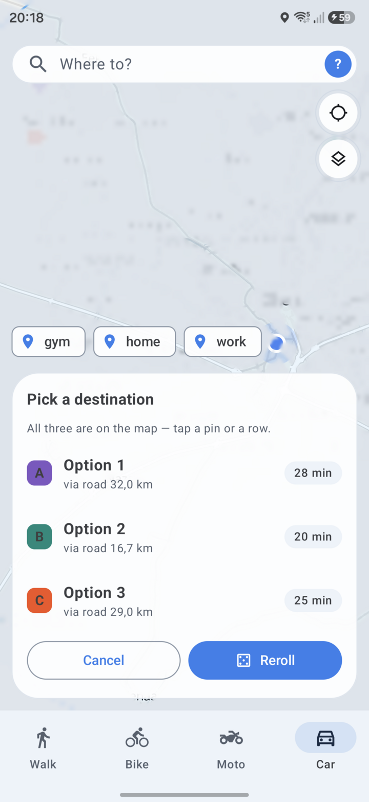

A spin returns **three candidates**, each routed, with distance and drive time.
They are all drawn on the map as lettered pins — tap a pin or a row to commit to
one. **Reroll** draws three new ones; **Cancel** drops them and leaves the map
as it was.

Picking one draws the route and leaves the destination pinned. From there you
can save it as a shortcut with the **Save pin** chip.

 

### Moto round trips

Moto mode doesn't hand you a destination — it builds a **loop**. The slider sets
total trip length, and the spin returns a ride out through the curviest roads
around you and back to where you started.

Curviness is junction-aware: turn radius is estimated per vertex triple from the
road geometry, and vertices that sit at intersections are excluded — so a left
turn at a crossroads doesn't score as a "curve", only sweeping bends within a
road do. The loop is handed to Google Maps as a multi-waypoint route, or driven
in-app like any other route.

With a routing server configured, the loop is a single request that comes back
following real roads. Without one, the app plans an approximate loop from
Overpass data and says so.

## Getting there

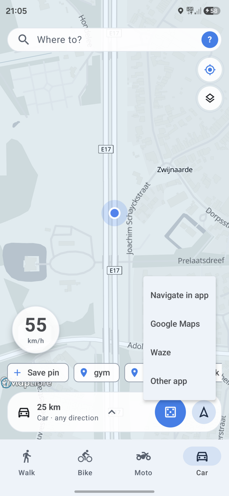

**Go**, in the spin sheet, offers:

- **Navigate in app** — turn-by-turn inside Detour, routed by your own
  GraphHopper instance (configured under Settings → Servers & sync). Without a
  routing server configured, this option isn't available.
- **Google Maps** / **Waze** / **Other app** — hand the destination off. For a
  moto round trip, Google Maps gets the whole waypoint chain.

Pick one and the app remembers it: Go launches it directly next time.
Long-press Go to bring the chooser back. Settings → Navigation shows the current
choice — *"Go currently launches: …"* — and resets it.

 

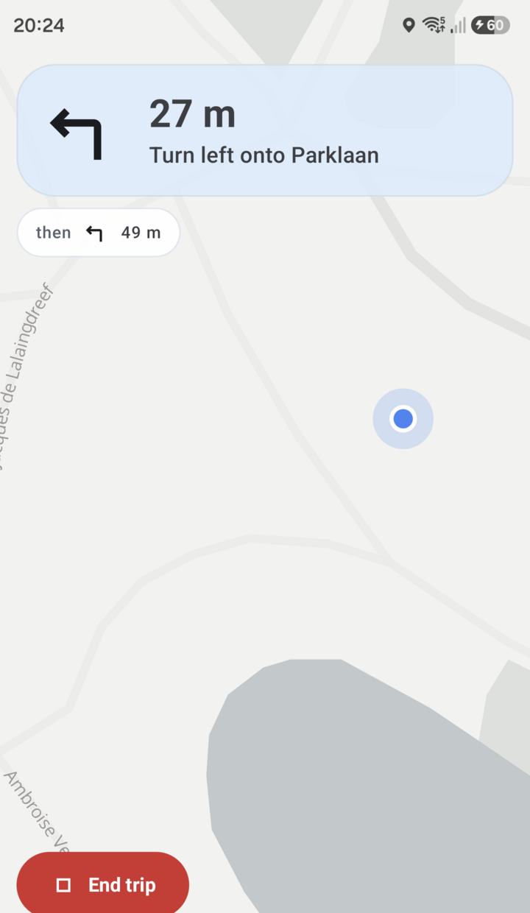

In-app navigation shows the next maneuver and the distance to it, a **then**
pill for the maneuver after that (so a turn-then-turn doesn't ambush you), and a
bottom bar with remaining distance, remaining time, arrival clock time and a
progress track. Leave the line and it reroutes; while it's off the route the bar
says so. The road behind you fades as you drive it, so what's left of the route
is the part that stands out — in whichever colour you set under Settings →
Appearance & map → Route line.

Your speed sits bottom-right with the posted limit beside it, and goes red when
you're over. **Speed cameras** — fixed cameras and Belgian *trajectcontrole*
sections, both from OpenStreetMap — are drawn on the map; a chime warns when one
is ahead and you're over the limit. Inside an average-speed section, the running
average for that section is shown next to your live speed, since that is the
number the camera pair actually judges.

Navigation can avoid motorways or avoid narrow rural lanes — see
[Settings reference](#settings-reference).

 

## Recording a ride

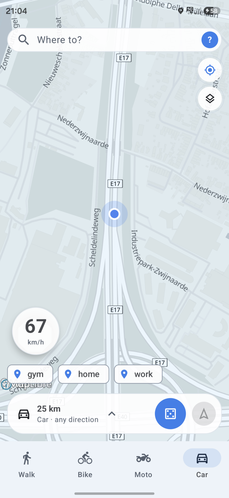

Two ways in:

- **Automatically.** With *Auto-detect drives* on (the default), a sustained
  driving pace starts a trip on its own and backdates it to when the drive
  really began. It ends itself when you stop for good, or when you come back to
  where you started after a real ride. A brief stop — traffic light, fuel — does
  not end it.
- **Manually.** *Track moto / car* in the spin sheet starts one immediately.
  The red **End trip** button on the map ends whichever trip is running.

A live card shows elapsed time, distance, top speed and — depending on the
vehicle — max lean angle and cornering g. On a moto both are recorded; in a car
only g.

**Vehicle auto-detect**: assign paired Bluetooth devices to a vehicle (an
intercom to the moto, the car's infotainment to the car) and a trip logs under
that vehicle whenever the device is connected. With nothing connected, a trip
that never picks up real driving pace is dropped rather than saved. These are
Bluetooth Classic bonds, so there's no scanning and no location permission
involved — only connect/disconnect.

If a trip is filed under the wrong vehicle, fix it afterwards from the history
list; false-positive detections can be deleted outright.

 

## Fog of war

<table>
  <tr>
    <td align="center">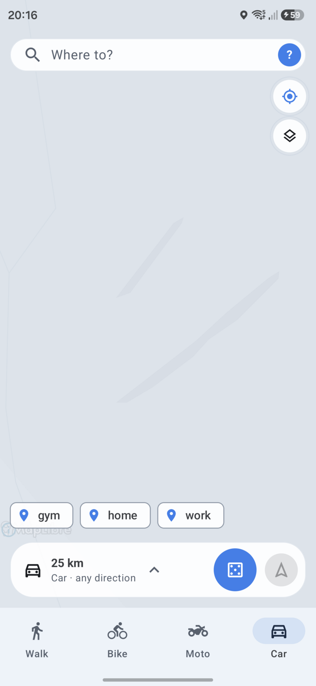 Unexplored ground stays covered</td>
    <td align="center">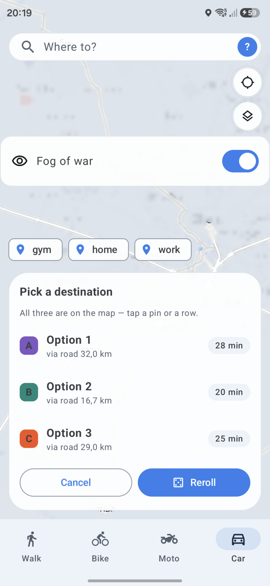 Layers → Fog of war</td>
  </tr>
</table>

Everywhere you have been is uncovered on the map, permanently. Everywhere else
is under a scrim. The reveal radius around your track is configurable (200 m by
default) under Settings → Fog of war, and the whole overlay can be switched off
from the layers button when you just want to read the map.

*Reset explored area* wipes it and starts you back at nothing.

With **Share fog with friends** on, accepted friends' explored ground is drawn
alongside yours, and yours alongside theirs. It's off by default and strictly
reciprocal: the server only hands you a friend's traces while you are sharing
your own.

## Search and saved places

<table>
  <tr>
    <td align="center">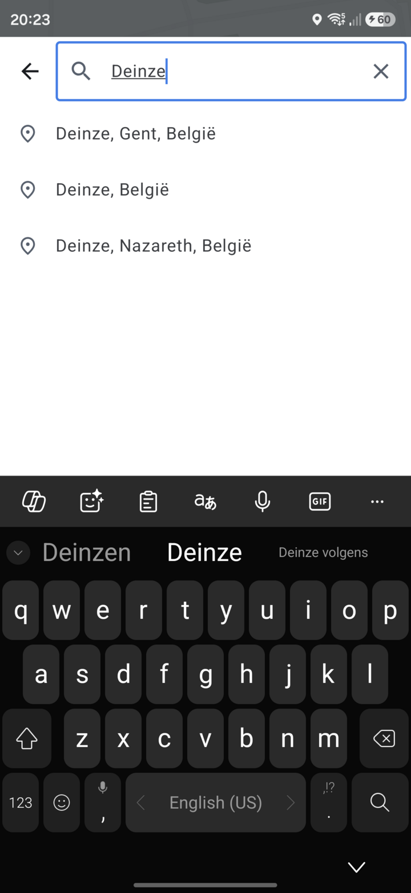 Search</td>
    <td align="center">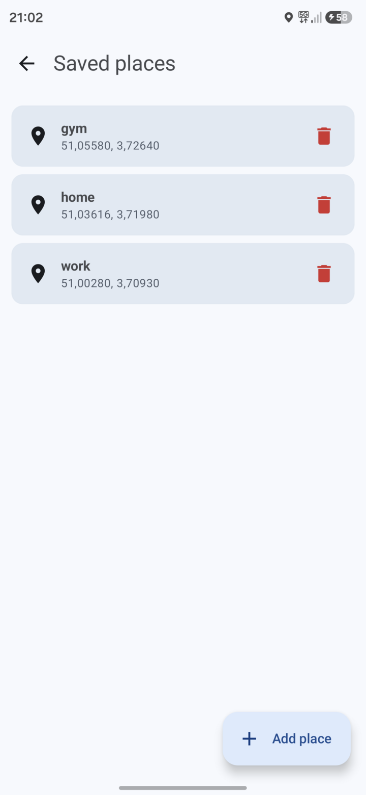 Saved places</td>
  </tr>
</table>

Search runs against Photon and streams suggestions as you type — no search
button. Recent picks stay on top of the list, then live results, ranked with
nearby hits first. Tapping a result drops it as the destination and moves the
map there.

Saved places are named shortcuts, listed under **You → Saved places** — empty at
first, prompting you to add Home, Work "or anywhere you stop often". Add one
after dropping or spinning a destination, or from that screen directly.

A saved place becomes a chip on the bottom sheet's chip row via the **+** button
next to **Spin**; one tap then makes it the current destination.

## Routes

A spin gives you one destination. A **route** is the other way round: stops you
chose, in the order you want them, kept for later. **You → Routes** lists them,
each with its stop count, distance and time.

- **Build one** by tapping the map to append stops, or searching for them, then
  reorder or drop any of them and pick a mode. The routing server strings them
  together.
- **Ride it** in the app, or hand the whole chain to Google Maps (up to nine via
  points; beyond that the extras are dropped rather than silently reordered).
- **Import and export GPX.** Export writes the routed track; import reads a GPX
  from anywhere, waypoints-only files included — those get routed on first use.
- **Share one with a friend.** It lands in their Routes list marked with your
  name. Un-friending someone deletes every route shared between you, in both
  directions.

Unlike trips and fog, routes are **not** part of sync: they live on the phone,
and a shared one only leaves it when you send it to someone. Export the ones you
want to keep before a reinstall.

## You: history, badges, friends

<table>
  <tr>
    <td align="center">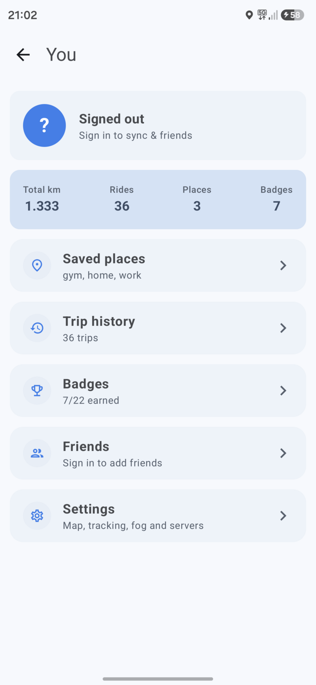 You</td>
    <td align="center">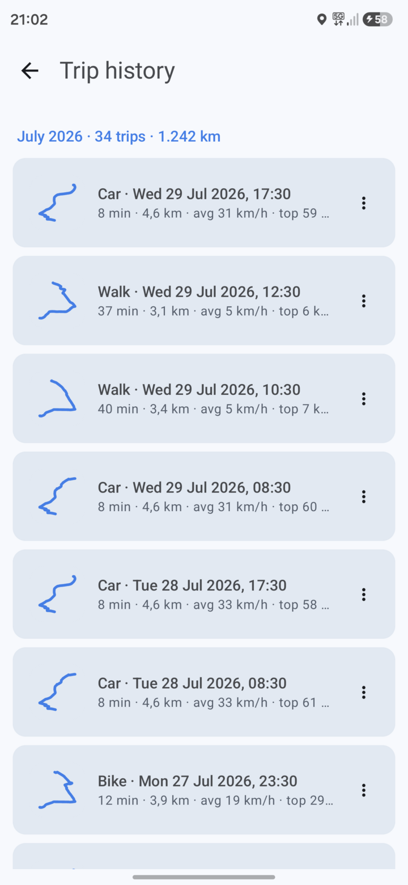 History</td>
    <td align="center">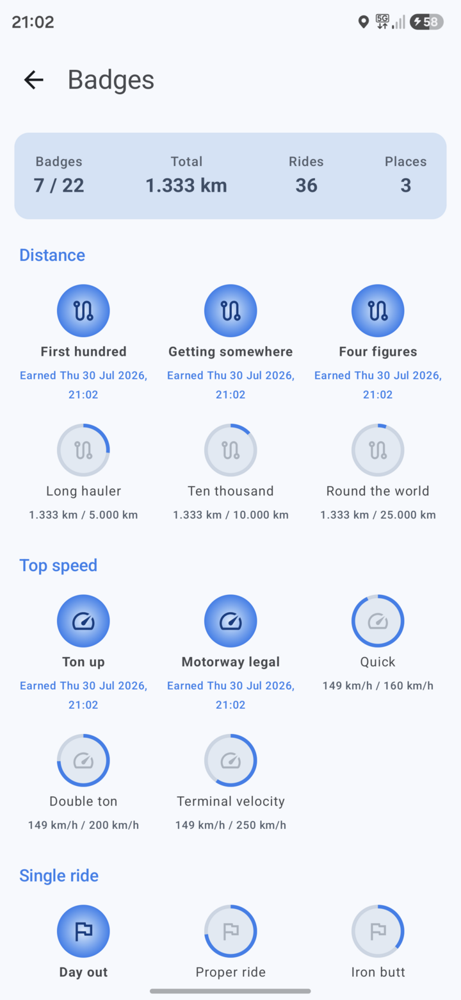 Badges</td>
  </tr>
</table>

The avatar in the search field opens **You**. At the top: your name, a
**Profile & account** link, and four lifetime totals — kilometres, rides,
places (municipalities entered) and badges earned. Under them, everything else
hangs off one list: **Trip history**, **Routes**, **Saved places**,
**Badges & coverage** (with your count, e.g. `8 / 22`) and **Social**. Settings
is the gear in the top right.

**Trip history** lists every ride, newest first, grouped by month with a monthly
total. Each row has a thumbnail of the route's shape, duration, distance,
average and top speed, plus peak lean and g where the mode records them. The ⋮
menu on a row lets you **change vehicle** (for a misclassified trip) or
**delete** it.

**Badges** track five categories — Distance, Top speed, Single ride, Places and
Coverage — with progress shown on the ones you haven't earned yet. Coverage is
how much of a municipality's road network you've actually driven, resolved from
OSM `admin_level=8` boundaries; "Places" counts municipalities entered at all.

**Social** is the hub for everything involving other riders, and all of it needs
an account on a sync server. It holds two entries: **Friends** and **Circles**.

**Friends** carries the **Leaderboard** and **Convoys** on one screen. Once
signed in you can add friends and compare totals, rides and badges. Friends
never see your trips or your map — only totals and badges, plus your fog if you
have opted into sharing it.

**Convoys** are for riding together, and start with **New convoy** on that same
screen: everyone in one sees the others move on the map in real time, and can
share a spin so the group votes on where to go. A convoy is per-ride — it exists
while you're in it and is gone when the last member leaves. *Push-to-talk is
currently off* — the relay accepts push-to-talk frames and drops them;
everything else in a convoy works. The in-app copy still offers push-to-talk
when you create one; that text is ahead of the server.

**Circles** are the long-lived counterpart: family or roommates rather than a
ride. The Circles screen lists each one with its members and a **Sharing**
state. A circle doesn't end when you stop driving, never carries voice, and
shows each member's last known position — posted every couple of minutes, so it
reads as "last seen", not a live trail. Share a saved place into one and
everyone sees arrivals and departures there; the geofence is worked out on your
own phone, so the stream of fixes behind it never leaves it. Sharing is per
person per circle and pausable at any time.

Both are invite-only and only ever from someone you're already friends with.
[CIRCLES_AND_CONVOYS.md](CIRCLES_AND_CONVOYS.md) covers how the two share one
mechanism, and documents the live protocol behind them.

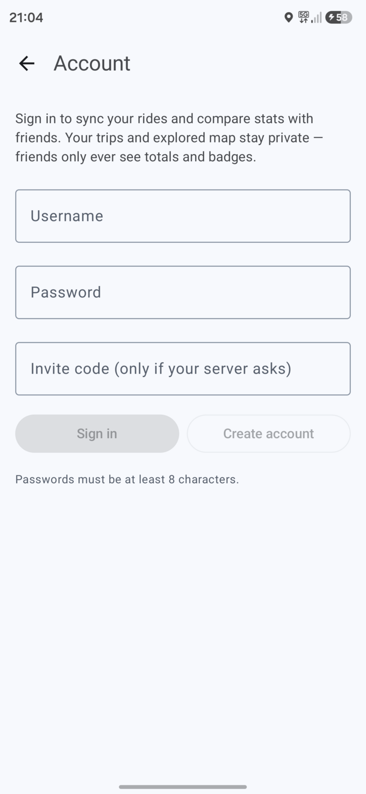

**Signing in happens in a browser, on your server's own sign-in page.** Tapping
sign in opens a Custom Tab at the server's identity provider (Keycloak); you
enter your details there and it hands the app back a token. Detour never sees
your password, and there is no password form, no registration form and no
invite-code box in the app — accounts, resets and who may register all live in
the realm's own pages.

The same account drives trip/trace sync, so a reinstall restores your history
and fog from the server.

 

## Settings reference

<table>
  <tr>
    <td align="center">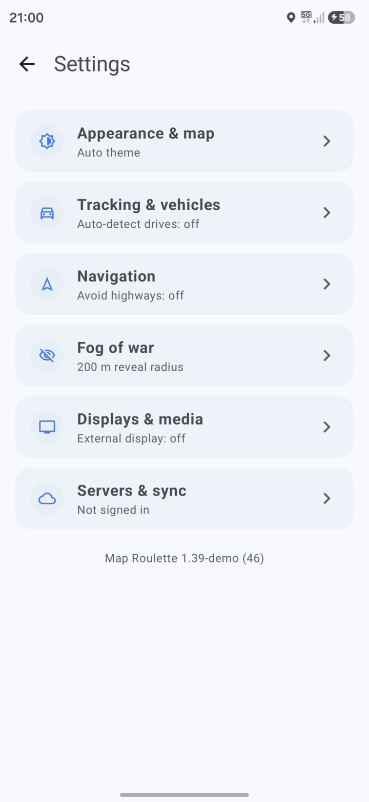 Settings</td>
    <td align="center">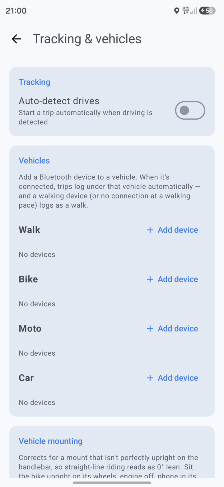 Tracking &amp; vehicles</td>
  </tr>
</table>

Settings is the gear in the top right of **You**. It is an index of six screens
in four groups, each row showing its current state underneath.

### Riding

**Tracking & vehicles**
- *Auto-detect drives* — start a trip automatically when driving is detected.
- *Vehicles* — assign a paired Bluetooth device to a vehicle; a trip then logs
  under that vehicle whenever the device is connected. The list needs Bluetooth
  access, and asks for it with an **Allow Bluetooth** button rather than at
  startup.
- *Vehicle mounting* — corrects a mount that isn't perfectly upright, so
  straight-line riding reads as 0° lean. Sit the bike upright on its wheels,
  engine off, phone in its normal mount, then **Calibrate**. The current offset
  is shown.

**Navigation**
- *Spoken guidance* — turn instructions read aloud while navigating, here and on
  the car screen. Mutable mid-drive from the speaker button there.
- *Remembered nav app* — reads *"Go currently launches: …"*. Long-press **Go**
  on the map to change it.
- *Avoid highways* — in-app navigation skips motorways. Car mode only; moto
  never uses them anyway.
- *Avoid small roads* — prefer real roads over narrow rural lanes, service roads
  and unpaved tracks.

### Map

**Appearance & map**
- *Theme* — System, Light, Dark, or **Auto** (light by day, dark by night,
  following sunrise and sunset at your location).
- *Decimal separator* — System, `1.2` or `1,2`. Governs distances, g, fuel
  economy, mount offset and map zoom. Speeds round to whole km/h so they never
  show one, and map coordinates always use a point so a latitude/longitude pair
  stays readable.
- *Your marker* — what's drawn where you are: **Blue dot**, or one of three
  vehicles seen from above — **Frontera**, **SUV**, **Saloon** — which turn to
  face the way you're heading.
- *Route line* — **Theme** (follows the accent), **Amber**, **Blue** or
  **Green**. Applies on the phone and the car screen. While navigating, the part
  you have already driven fades to the darker shade, so the road ahead is the
  bright one.
- *Default zoom* — where the map sits while following you. It zooms out up to
  two levels at speed and back in near a turn.

**Fog of war**
- *Reveal radius* — how wide a corridor your track uncovers. 200 m by default.
- *Share fog with friends* — reciprocal, off by default. Only friends who share
  back can see yours; off, nobody sees either.
- *Reset explored area* — wipe the fog.

### Devices

**Displays & media**
- *External display* — broadcast navigation to an external screen, and show
  what's playing on it. Needs Bluetooth permission, and notification access for
  the now-playing part.

**OBD2 adapter**
- Connect a vehicle's OBD2 adapter for accurate speed. Not covered elsewhere in
  this guide yet.

### Account

**Servers & sync** — three parts.

*Status* shows the server you are pointed at, whether you are signed in and when
sync last ran (*"Signed in as … · synced 6m ago"*), and whether a server config
file is ready to export.

*Actions* are **Sync now**, **Export config** and **Import config** — the last
two move your whole server setup between devices, so you type it once.

*Server* takes one address covering routing, search, sync and live. **Show
advanced** splits it per service, for a deployment spread across hostnames;
anything left empty falls back to the single address. The screen explains the
one case where a single address cannot work: the API answers `/api/trips` and a
Photon search server answers `/api/`, so those two cannot share a host.

## Pointing the app at your server

Every address — the API, its per-service overrides, and the sign-in realm alike
— can be typed into Settings → Servers & sync at runtime, on Android and iOS
both. Nothing has to be baked into a build for sign-in to work; changing the
realm signs the device out immediately, because tokens issued by one realm mean
nothing to another.

Settings → **Servers & sync** takes **one** server address covering routing,
search, sync and live. **Show advanced** splits it per service for a deployment
spread across hostnames; anything left blank falls back to the single address.

| What it points at | Without it |
| --- | --- |
| The Detour API (sync) | No account, no sync, no friends, circles or convoys. Everything else still works. |
| Your Keycloak realm (sign-in) | Sign-in cannot start. |
| Your GraphHopper (routing) | "Navigate in app" is absent, and spin candidates show straight-line distance. |
| Your Photon (search) | Search silently uses the public `photon.komoot.io`. |

One address cannot serve both sync and search: the API answers `/api/trips` and
a Photon server answers `/api/`, so those two need separate hosts. The advanced
fields exist for exactly that.

The APKs published on the releases page are built by CI with **no** server
configuration baked in, deliberately: a public release should not ship someone
else's server address. That does not disable sign-in, only preconfigure it.

Standing those services up is [../README.md](../README.md) and
[../backend/INSTALL.md](../backend/INSTALL.md).

## On the car screen

Android Auto gets a car-sized spin: pick a radius, spin a destination, and drive
it turn by turn on the head unit, with the same map, speed readout and camera
warnings as the phone. Search works there too.

One catch, and it is Google's rather than the app's: a real head unit only lists
apps built on the Android for Cars App Library when they were installed **from
Google Play**. The Desktop Head Unit accepts a sideloaded APK, a car never does.
[ANDROID_AUTO.md](ANDROID_AUTO.md) covers the Internal App Sharing route and how
to debug the car screen.

## On iPhone

A SwiftUI app in `iosApp/` runs on the same core as the Android one: map and
spin, trip recording in the background, history with GPX export, badges, saved
places and in-app turn-by-turn with spoken directions.

**Sign-in works on iPhone.** It moved to the identity provider's own page in a
browser, and iOS supplies its half of that — `ASWebAuthenticationSession` plus
`SecRandomCopyBytes` — the same way Android supplies a Custom Tab plus
`SecureRandom`; the authorization-code-with-PKCE flow itself is shared
(`shared/.../data/Oidc.kt`). That unblocks everything that was gated on an
account: sync, friends and the leaderboard, convoys, circles and the group
spin.

Be as honest here as [IOS_PORT.md](IOS_PORT.md) is: what has actually been
exercised is narrower than "works" sounds. The shared flow has unit tests, the
Android side has been driven on a real device, and the iOS side is verified only
as far as CI's `ios.yml` reaches — it compiles, boots the simulator and gets
screenshotted. CI cannot reach a private Keycloak, so nobody has yet watched an
iPhone finish the browser leg against a real realm. Treat that leg as untested,
not working, until someone has.

Two things are Android-only and are not coming to iOS: **Android Auto**
(CarPlay navigation needs an entitlement Apple grants on application, and
routinely refuses for hobby apps) and **now-playing media** on an external
display (iOS exposes no equivalent).

Where the platforms behave differently — trip auto-detection, how lean and g
are measured, guidance audio ducking — the reasoning for each is in
[IOS_PORT.md](IOS_PORT.md).

There is no download. CI builds a simulator app and an **unsigned** `.ipa` on
every change, but signing one for a real phone needs a certificate from a paid
Apple Developer account, which no CI trick removes.

## What leaves your device

Even without a sync server, a few features talk to the network by design:
Overpass sees the spin center and radius you choose, OpenFreeMap's tiles see
your current map viewport, and address/place search sends your query (and an
approximate location, to rank nearby results first) to Photon — your own
instance if you've set one in Settings, otherwise the public
`photon.komoot.io`. If you self-host Photon, search falls back to the public
instance only when yours is unreachable, and only if you leave "Fall back to
public search" turned on; turn it off to keep search on your own hardware even
when your instance is down.

**Circles are the one feature where the server keeps a position.** Everything
else is either never uploaded or uploaded as a record only you can read — a
convoy's live feed is relayed between open sockets and never written down. A
circle stores one row per member: your latest fix, overwritten in place, no
history and no trail. It exists only for circles you joined, only while that
circle's sharing switch is on, and pausing is enforced by the server rather
than trusted to the app. Leaving a circle deletes it.

The published privacy policy is [privacy.html](privacy.html).
